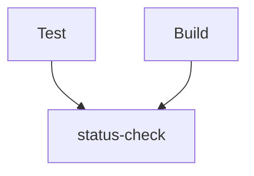

# required-status-check-action

[](https://raw.githubusercontent.com/suzuki-shunsuke/required-status-check-action/main/LICENSE) | [action.yaml](action.yaml)

`required-status-check-action` is a GitHub Action to validate if a specific job (we call `status-check` job) depends on all required jobs directly or indirectly.
This action allows you to configure GitHub Branch Rulesets' `Require status checks to pass` easily and correctly.

You should enable Branch Rulesets' `Require status checks to pass` and configure `Status checks that are required` properly to ensure that all pull requests pass all tests before merged.

But if you add all jobs to `Status checks that are required`, it's troublesome to add, remove, or rename required jobs because you need to fix both workflows and Branch Rulesets.
If you add a new check to `Status checks that are required` before updating workflows, you can't merge pull requests until workflows are updated.
If many users develop in the repository, the temporary gap between workflows and `Status checks that are required` is troublesome.
If you add a job to a workflow but forget to update `Status checks that are required`, you can merge pull requests even if the job fails.

So we recommend making all jobs depending on a single job, making the job fail unless all jobs succeed, and adding only the job to `Status checks that are required`.
We call this job `status-check` job.



Then we don't need to update the Branch Rulesets.

But in this case, we need to configure `status-check` properly.

- The status of `status-check` must be `success` or `skipped` only if all required jobs pass.
- The status of `status-check` must be `failure` or `cancelled` only if any jobs fail.

So you should configure `status-check` as the following:

```yaml
status-check:
  needs: [foo, bar]
  runs-on: ubuntu-24.04
  if: always()
  permissions:
    contents: read # To get the workflow content by GitHub API
  steps:
    - uses: suzuki-shunsuke/required-status-check-action@main
      with:
        needs: ${{ toJson(needs) }}
```

The action fails if any job fails.

And if you add a job `zoo`, you also need to add the job to status-check's `needs`.

```yaml
needs: [foo, bar]
```

This action fails if `status-check` doesn't depend on `zoo` directly or indirectly.

In some cases, you may want to run some jobs after `status-check`.
For instance, you may want to merge the pull request after `status-check`:

```yaml
merge:
  needs: [status-check]
  runs-on: ubuntu-24.04
  steps:
    # ...
```

This action allows this kind of jobs.

## How To Use

1. Create a `pull_request` or `pull_request_target` workflow
2. Add a job `status-check` and adds all jobs that must pass to `status-check`'s needs

```yaml
status-check:
  needs:
    - test
    - build
```

3. Set `if: always()` to `status-check`:

```yaml
status-check:
  if: always()
```

4. Run this action in `status-check` with `needs: ${{ toJson(needs) }}`:

```yaml
- uses: suzuki-shunsuke/required-status-check-action@main
  with:
    needs: ${{ toJson(needs) }}
```

Workflow:

```yaml
name: pull request
on: pull_request
jobs:
  test:
    runs-on: ubuntu-24.04
    steps:
      - run: echo test
  build:
    runs-on: ubuntu-24.04
    steps:
      - run: echo build

  status-check:
    needs:
      - test
      - build
    if: always()
    permissions:
      contents: read # To get the workflow content by GitHub API
    steps:
      - uses: suzuki-shunsuke/required-status-check-action@main
        with:
          needs: ${{ toJson(needs) }}
```

## Appendix

Note that there are bugs about the evaluation of GitHub Actions' job's if statement.

- https://github.com/actions/runner/issues/491
- https://github.com/orgs/community/discussions/45058

### Bad setting 1. `failure()`

:x: So the following settings don't work as expected:

```yaml
status-check:
  runs-on: ubuntu-24.04
  needs: [foo, bar]
  if: failure()
  steps:
    - run: exit 1
```

The problem of this setting is that if you rerun only `foo` and `foo` succeeds, `status-check` is skipped and the pull request can be merged even if `bar` still fails.

### Bad setting 2

The following setting don't work as expected as well:

```yaml
status-check:
  runs-on: ubuntu-24.04
  needs: [foo, bar]
  if: contains(needs.*.result, 'failure') || contains(needs.*.result, 'cancelled')
  steps:
    - run: exit 1
```

The problem of this setting is that even if `foo` and `bar` fail `status-check` is skipped.

### Bad setting 3

If `if` statement isn't set, status-check is skipped if `foo` or `bar` fails:

```yaml
status-check:
  runs-on: ubuntu-24.04
  needs: [foo, bar]
  steps:
    - run: exit 0
```
